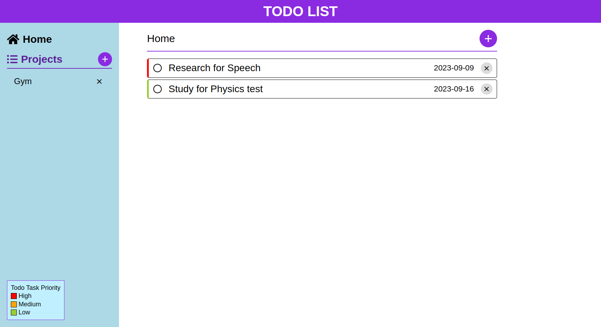

# Todo List
## About
- Todo List Project created using HTML, CSS, and Vanilla Javascript following TheOdinProject's [curriculum](https://theodinproject.com).
- Live Preview -> [Here](https://devashishchakra.github.io/todolist)

## Screenshots

## What I learned
- Single Responsibility Principle
- Webpack
- Javascript Modules
- Use of internalStorage in JS